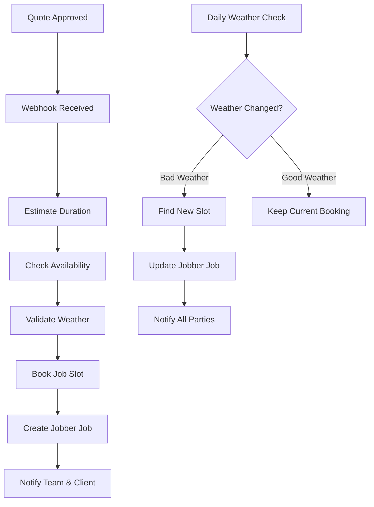

# Shimmer & Shine Jobber Integration

> **Automated quote-to-booking workflow system for professional window cleaning services**

[](https://python.org)
[](https://fastapi.tiangolo.com/)
[]()

## Overview

The Shimmer & Shine Jobber Integration is an intelligent automation system that streamlines the entire customer journey from quote approval to job completion. Built specifically for **Shimmer & Shine Window Cleaning Ltd.**, this system eliminates manual scheduling overhead while ensuring optimal resource allocation and customer satisfaction.

### Key Features 

- **🚀 Zero-Touch Automation**: Quotes automatically convert to scheduled jobs
- **🌤️ Weather Intelligence**: Smart scheduling based on weather conditions  
- **📅 Optimal Scheduling**: Intelligent time slot management with crew availability
- **📱 Real-Time Notifications**: Automated updates for both teams and customers
- **⚡ FastAPI Performance**: High-performance async API architecture

---

## System Architecture

### Core Components

| Component | Purpose | Technology |
|-----------|---------|------------|
| **Webhook Handler** | Processes Jobber quote approvals | FastAPI |
| **Scheduler Engine** | Finds optimal booking slots | Custom Algorithm |
| **Weather Service** | Validates weather conditions | OpenWeatherMap API |
| **Database Layer** | Persistent booking storage | SQLite |
| **Jobber Integration** | Creates jobs & sends notifications | GraphQL API |

### Workflow



---

## Features

### 🎯 Intelligent Scheduling

- **Duration Estimation**: Automatic job duration calculation based on quote value
  - Full day (8h): $1,440+
  - Half day (4h): $720
  - Hourly rate: $180/hour
- **Availability Checking**: Real-time calendar conflict detection
- **Grace Periods**: 30-minute buffers between appointments

### 🌦️ Weather Integration

- **Forecast Analysis**: 5-day weather prediction integration
- **Precipitation Filtering**: Automatic rescheduling for rain/snow (>50% probability)
- **Severe Weather Protection**: Thunder and snowstorm avoidance
- **Periodic Rechecking**: Daily weather validation 24-48 hours before scheduled jobs
- **Automatic Rescheduling**: Smart rebooking when weather conditions deteriorate

### 📋 Business Logic

- **Working Hours**: Monday-Friday, 9 AM - 5 PM scheduling
- **Holiday Awareness**: Automatic holiday detection and avoidance  
- **30-Day Horizon**: Intelligent slot searching up to 30 days ahead
- **Conflict Resolution**: Smart handling of scheduling conflicts

### 🔧 Development Features

- **Test Mode**: Complete mock environment for development
- **OAuth 2.0**: Secure Jobber API authentication
- **Comprehensive Logging**: Full audit trail of all operations
- **Error Handling**: Robust exception management and recovery

---

## Getting Started

### Prerequisites

- Python 3.9.13+
- Valid Jobber API credentials
- OpenWeatherMap API key
- ngrok (for development webhooks)

### Installation

1. **Clone the repository**
   ```bash
   git clone <repository-url>
   cd jobber-quotes-scheduler
   ```

2. **Install dependencies**
   ```bash
   pip install -r requirements.txt
   ```

3. **Configure environment variables**
   ```bash
   cp .env.example .env
   # Edit .env with your API credentials
   ```

4. **Initialize the database**
   ```bash
   python -c "from src.db import init_db; init_db()"
   ```

### Configuration

Create a `.env` file with the following variables:

```env
# Jobber API Configuration
JOBBER_CLIENT_ID=your_client_id
JOBBER_CLIENT_SECRET=your_client_secret
JOBBER_API_BASE=https://api.getjobber.com/api
JOBBER_API_KEY=your_api_key

# Weather Service
OPENWEATHER_API_KEY=your_weather_key

# Development Mode
TEST_MODE=True
```

### Running the Application

#### Development Mode
```bash
python main.py
```
The API will be available at `http://localhost:8000`

#### Production Mode
```bash
uvicorn src.webapp:app --host 0.0.0.0 --port 8000 --workers 4
```

---

## API Documentation

### Endpoints

#### `POST /book-job`
Webhook endpoint for processing approved quotes.

**Request Body:**
```json
{
  "id": "Q123",
  "quoteStatus": "APPROVED", 
  "amounts": {"totalPrice": 500.00},
  "client": {"properties": [{"city": "Saskatoon"}]}
}
```

**Response:**
```json
{
  "status": "Quote Q123 approved and scheduled",
  "scheduled_start": "2025-09-01T09:00:00",
  "scheduled_end": "2025-09-01T12:00:00",
  "job_id": "JQuote_Q123",
  "cost": 500.00,
  "visits_count": 1
}
```

#### `GET /auth`
Initiates OAuth flow with Jobber.

#### `GET /oauth/callback`  
Handles OAuth callback from Jobber.

---

## Testing

### Running Tests

```bash
# Run all tests
python -m pytest testing/

# Run with coverage
python -m pytest testing/ --cov=src

# Run specific test file
python -m pytest testing/test_book_job.py -v
```

### Test Configuration

Set `TEST_MODE=True` in your `.env` file to use mock data instead of real API calls.

**Test Coverage:**
- ✅ Quote approval workflow
- ✅ Scheduling logic validation  
- ✅ Weather condition checking
- ✅ Error handling scenarios
- ✅ Authentication flows

---

## Project Structure

```
shimmer-shine-scheduler/
├── 📁 config/              # Configuration management
│   ├── settings.py         # Environment variable handling
│   └── __init__.py
├── 📁 src/                 # Core application code
│   ├── main.py            # Application entry point
│   ├── webapp.py          # FastAPI application & routes
│   ├── db.py              # Database operations
│   └── 📁 api/            # API integrations
│       ├── jobber_client.py  # Jobber GraphQL client
│       ├── scheduler.py      # Scheduling algorithms
│       └── weather.py        # Weather service integration
├── 📁 testing/            # Test suite
│   ├── test_book_job.py   # Main workflow tests
│   └── mock_data.py       # Test data generators
├── 📁 docs/               # Documentation & legal
│   ├── privacy-policy.html
│   └── terms-of-service.html
├── requirements.txt       # Python dependencies
└── README.md             # This file
```

---

## Deployment

### Environment Setup

The application supports multiple deployment environments:

- **Development**: Local testing with ngrok webhooks
- **Staging**: Cloud deployment with test credentials  
- **Production**: Full Jobber API integration

### Docker Support

```bash
# Build image
docker build -t shimmer-shine-scheduler .

# Run container  
docker-compose up -d
```

---

## Support

### Legal Compliance

- [Privacy Policy](https://benavery28.github.io/Jobber-Quotes/privacy-policy.html)
- [Terms of Service](https://benavery28.github.io/Jobber-Quotes/terms-of-service.html)

### Contact Information

**Technical Support**: sales@shimmershine.org  
**Business Inquiries**: sales@shimmershine.org

---

## License

This software is proprietary to **Shimmer & Shine Window Cleaning Ltd.** All rights reserved.

---

## Development Team

**Developed by**: Ben & Andrei  
**Company**: Shimmer & Shine Window Cleaning Ltd.

---
